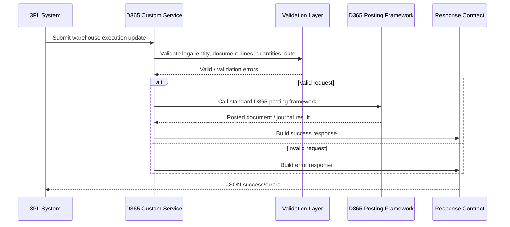

# 3PL API Architecture

## Business problem

A third-party logistics provider needs to send warehouse execution updates into Dynamics 365 Finance & Operations after physical warehouse activities are completed outside D365.

The integration supports these operation patterns:

- Sales packing slip posting
- Transfer order shipment and receipt
- Counting journal posting
- Purchase order receipt
- Return packing slip / return receipt scenarios

## High-level flow

## Components

| Component | Responsibility |
|---|---|
| Request contracts | Define the JSON payload fields accepted by D365 |
| Response contracts | Return a consistent success, data, and errors structure |
| Validation layer | Prevent incomplete or unsafe posting requests |
| Service class | Orchestrates validation, company context, posting, and response |
| Posting framework | Performs D365-compliant transaction posting |
| Error handler | Converts infolog and validation messages into API-friendly response errors |

## Upgrade-safe design

The service should avoid direct inserts or updates to posted transaction tables when standard D365 posting frameworks exist. The custom service acts as an integration facade, validates the external request, prepares posting parameters, calls the standard framework, and returns a structured response.

## Example operation names

| Operation | Purpose |
|---|---|
| `postSalesPackingSlip` | Post sales order packing slip based on delivered lines |
| `postTransferOrderShipment` | Post transfer order shipment |
| `postTransferOrderReceipt` | Post transfer order receipt |
| `postCountingJournal` | Post inventory counting journal |
| `postPurchaseOrderReceipt` | Post PO product receipt |
| `postReturnPackingSlip` | Process return packing slip / return receipt scenario |
